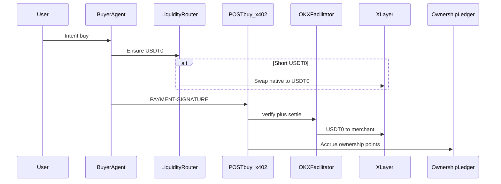

# Borneo × OKX Dev Day

Source of truth for this prototype. Landing copy, demo script, and product decisions should map here.

**Design read:** cinematic product landing for OKX Dev Day judges — intent-native commerce on X Layer / Onchain OS (Syne + IBM Plex, jade / ember / ink).

**Dials:** `DESIGN_VARIANCE: 6` · `MOTION_INTENSITY: 5` · `VISUAL_DENSITY: 4`

**Primary track:** Build a Market

---

## Problem

Users hold fragmented assets. Buying merch, tokenized RWAs, or micro-payments usually means manual swaps, gas friction, and separate rails. Agent commerce catalogs are also walled — merchants listing only inside a few chat apps are invisible to the long tail of agents.

**Challenge framing:** An AI shopping agent bridges natural-language intent to **X Layer liquidity routing** and **USDT0 x402 settlement** via OKX Onchain OS, then redistributes protocol upside as **network ownership** so users switch for seamless conversion *and* stake.

---

## Expected submissions (map 1:1)

| Pillar | What we ship | Live surface |
|---|---|---|
| **AI Agent Layer** | Intent buyer agent — clarify, search, compare, hand off to pay | `/buyer` |
| **Liquidity routing** | Balance check + OKX DEX quote/execute (native → USDT0) before settle | Consent modal + `/api/liquidity` |
| **Merchant access** | Chat onboard → published agent storefront (+ RWA desk SKUs) | `/onboard`, `/market` |
| **Seamless payment** | USDT0 x402 on X Layer (OKX facilitator) + optional Visa rail | `/buyer` checkout |
| **Ownership flywheel** | Protocol fee bps → ownership points + invite boost | `/buyer/ownership` |
| **Trust / consent** | Preview + authorize; locked quote; catalog cannot change payee/amount | Consent modal |

Do not claim voice unless we ship it. Vertical: fashion + tokenized/RWA demo listings.

---

## Demo path (judges)

1. `/` landing: fragmented balances → intent → route → settle → own
2. `/buyer`: "Buy this drop" or "Deploy funds into this asset" → picks (fashion or RWA desk)
3. Consent: liquidity route preview (USDT0 balance / native → USDT0 plan)
4. Authorize → x402 settle → explorer receipt → ownership accrual
5. Optional: `POST /s/{slug}/buy` 402 challenge + `/buyer/ownership` invite loop

Fail-soft: missing `BUYER_PRIVATE_KEY` still shows the 402 challenge. Missing DEX liquidity shows a **plan** route and settles when USDT0 is funded.

---

## Architecture (short)

- **Buyer agent:** `/buyer`, `/api/buyer-chat` — discovers via `/llms.txt` + registry
- **Liquidity:** `/api/liquidity` + `src/lib/liquidity/route.ts` — OKX DEX aggregator
- **Crypto rail:** HTTP 402 → USDT0 on X Layer → OKX facilitator settle
- **Ownership:** app-layer fee accrual (merchant still receives full listed USDT0)
- **Builder tooling:** Onchain OS skills + Cursor MCP (`onchainos mcp`)

---

## Trust model

1. Buyer sees a **transaction preview** (item, merchant, amount, route, rail).
2. Buyer **confirms** (`Authorize purchase`). No confirm, no charge.
3. x402: payTo + atomic amount must match the locked quote.
4. Ownership points are **not** a security — demo network stake from protocol fee narrative.
5. Protocol log is visible so the handshake is inspectable.

---

## Landing page contract

- Shopper: `Shop with Borneo` → `/buyer`
- Sellers: `Publish a storefront` → `/onboard`
- Hero thesis: intent → route → settle → own on X Layer
