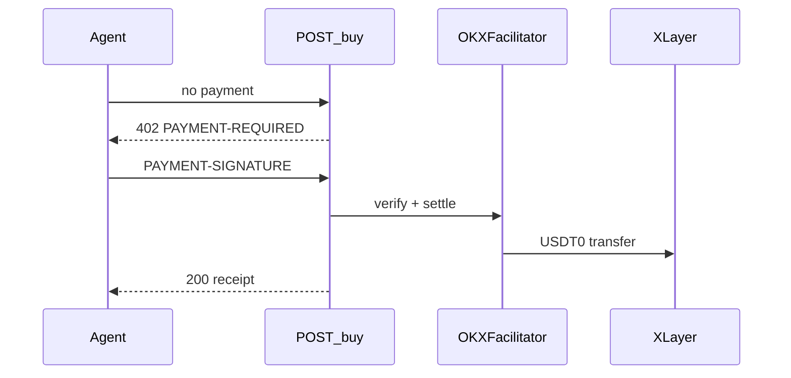

# Borneo × OKX Dev Day

Source of truth for this prototype. Landing copy, demo script, and product decisions should map here.

**Design read:** cinematic product landing for OKX Dev Day judges — open agent commerce on X Layer / Onchain OS (Syne + IBM Plex, jade / ember / ink).

**Dials:** `DESIGN_VARIANCE: 6` · `MOTION_INTENSITY: 5` · `VISUAL_DENSITY: 4`

---

## Problem

Agent commerce catalogs are walled. Merchants who only list inside a few chat apps are invisible to procurement bots, local LLMs, and personal agents. Settlement should be agent-native: pay-per-call x402 on a production L2 with OKX infrastructure.

**Challenge framing:** Enable any merchant to publish an agent-readable storefront once, let any HTTP agent discover and buy, and settle **USDT0 on X Layer** via **OKX Onchain OS** (Agentic Wallet + Payment SDK / A2MCP).

---

## Expected submissions (map 1:1)

| Pillar | What we ship | Live surface |
|---|---|---|
| **AI Agent Layer** | Fashion buyer agent — clarify intent, rank via `/api/search`, compare, hand off to pay | `/buyer` |
| **Merchant access** | Chat onboard: type inventory, CSV, or Shopify URL → published agent storefront | `/onboard` |
| **Seamless payment** | USDT0 x402 on X Layer (OKX facilitator) + optional Visa-style scoped card in chat | `/buyer` checkout |
| **Trust / consent** | Preview + authorize; locked quote; catalog text cannot change payee/amount | Consent modal |

Do not claim voice unless we ship it. Category is **fashion / apparel**.

---

## Demo path (judges)

1. `/` landing: open protocol vs closed catalogs; X Layer settle
2. `/onboard`: talk a catalog live, publish
3. `/buyer`: "I want a t-shirt" → compare → pick USDT0 or Visa → authorize
4. Optional: show `POST /s/{slug}/buy` 402 challenge (A2MCP shape) + Onchain OS MCP tools

Fail-soft: missing `BUYER_PRIVATE_KEY` still shows the 402 challenge. Missing OKX keys fails settle with a clear error.

---

## Architecture (short)

- **Buyer agent:** `/buyer`, `/api/buyer-chat` — discovers via `/llms.txt` + registry, not HTML scraping
- **Merchant agent:** `/onboard`, `/api/merchant-agent`
- **Crypto rail:** HTTP 402 → USDT0 on X Layer (`eip155:1952` testnet) → `PAYMENT-SIGNATURE` → OKX facilitator settle
- **Visa rail:** local scoped-card mandate (StraitsX MCP optional)
- **Builder tooling:** Onchain OS skills + Cursor MCP (`onchainos mcp`)

---

## Trust model

1. Buyer sees a **transaction preview** (item, merchant, amount, rail).
2. Buyer **confirms** (`Authorize purchase`). No confirm, no charge.
3. x402: payTo + atomic amount must match the locked quote.
4. Merchant publish: optional EVM wallet proof (MetaMask / private key).
5. Protocol log is visible so the handshake is inspectable.

---

## Landing page contract

- Shopper: `Shop fashion` → `/buyer`
- Merchant: `Open a store` → `/onboard`

**Hero:** discover / decide / pay in one conversation on X Layer. Name USDT0 x402 and authorize-before-pay.

**Banned:** protocol-only handshake as the first narrative; filler verbs (unleash, elevate, next-gen).

---

## Docs

- [`docs/okx-onchainos.md`](./docs/okx-onchainos.md)
- [`scripts/setup-xlayer-usdt0.md`](./scripts/setup-xlayer-usdt0.md)
- [`.agents/skills/okx-devday-resources/SKILL.md`](./.agents/skills/okx-devday-resources/SKILL.md)
