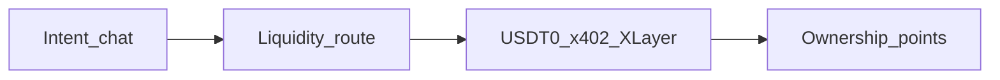

<div align="center">

# Borneo

[](#borneo)
[](#borneo)
[](#borneo)
[](https://nextjs.org/)

**Intent → route → settle → own. AI shopping on X Layer.**

Landing → [http://localhost:3000](http://localhost:3000) · OKX docs map → [`docs/okx-onchainos.md`](./docs/okx-onchainos.md) · Pitch → [`PITCH.md`](./PITCH.md)

</div>

---

## The problem

Users hold fragmented assets. Buying products, tokenized RWAs, or micro-payments usually means manual swaps and separate rails. Agent catalogs are often walled inside a few chat apps.

## Borneo @ OKX Dev Day (Build a Market)

**An AI-native shopping agent** takes natural-language intent, **routes liquidity on X Layer** into USDT0 via OKX DEX, **settles with x402**, and accrues **network ownership** from a protocol micro-fee — so conversion is seamless *and* users earn stake.



| Step | Surface |
|---|---|
| Intent | `/buyer` salesperson + `GET /api/search` |
| Route | `GET/POST /api/liquidity` · OKX DEX · outfit liquidity map |
| Buy (A2MCP-shaped) | `POST /s/{slug}/buy` → **402** → authorize → settle |
| Own | `/buyer/ownership` · invite `?ref=` boost |
| Outfit demo | `/s/atelier-tee` · `/s/harbor-caps` · `/s/stride-kicks` |
| RWA demo | `/s/xlayer-rwa-desk` tokenized claim SKUs |
| Skills | [`.agents/skills/borneo-registry-shop`](./.agents/skills/borneo-registry-shop/SKILL.md), Onchain OS pack |

**Do not scrape HTML.** Catalog prose never enters the pay path — settle only sees a locked quote (`storeSlug`, `skuId`, `price`, `merchantAddress`). Merchant still receives **full listed USDT0**; ownership is app-layer accrual from `PROTOCOL_FEE_BPS`.

---

## Try it

```bash
npm install
cp .env.example .env
# Fill BUYER_PRIVATE_KEY, MERCHANT_ADDRESS, OKX_*, Firebase, OPENAI
# See scripts/setup-xlayer-usdt0.md
npm run dev
```

| Path | What it is |
|---|---|
| `/` | Landing — intent → route → settle → own |
| `/merchant` · `/onboard` | Seller chat → publish agent storefront |
| `/buyer` | Intent chat → route preview → USDT0 / Visa |
| `/buyer/ownership` | Network stake + friend invite loop |
| `/market` | Marketplace index (fashion + RWA desk) |
| `/api/search?q=` | Intent search |
| `/api/liquidity?price=` | Liquidity route preview |
| `/registry.json` | Network store index |
| `/demo` | Judge handshake script |

### Env (see [`.env.example`](.env.example))

| Var | Purpose |
|---|---|
| `OPENAI_API_KEY` | Agents + embeddings search |
| `NEXT_PUBLIC_FIREBASE_*` | Buyer + merchant auth |
| `BUYER_PRIVATE_KEY` | Server-side x402 + optional DEX swap |
| `MERCHANT_ADDRESS` | Default merchant payTo (`0x…`) |
| `OKX_API_KEY` / `OKX_SECRET_KEY` / `OKX_PASSPHRASE` | Facilitator + DEX quote |
| `PROTOCOL_FEE_BPS` | Ownership accrual rate (default `50`) |
| `TREASURY_ADDRESS` | Fee narrative address |
| `XLAYER_NETWORK` | `eip155:1952` (testnet) or `eip155:196` |

### Contract / asset references (testnet defaults)

| Asset | Address |
|---|---|
| USDT0 (X Layer testnet) | `0x9e29b3aada05bf2d2c827af80bd28dc0b9b4fb0c` |
| RWA demo claim (catalog) | see `/s/xlayer-rwa-desk` tokenization fields |
| Explorer | `https://www.okx.com/web3/explorer/xlayer-test` |

### Onchain OS MCP

```bash
npx skills add okx/onchainos-skills --yes
```

### Scripts

| Command | Purpose |
|---|---|
| `npm run dev` | Local Next.js |
| `npm run build` / `npm start` | Production |
| `npm run lint` | ESLint |

---

## Submission checklist (OKX Dev Day)

- [ ] Primary track: **Build a Market**
- [ ] Public repo + this README
- [ ] Live product URL (https://okx-dev-day2026.vercel.app)
- [ ] Demo video 2–4 min: intent → route → settle → ownership (+ optional RWA SKU)
- [ ] Contract / explorer links in video or README
- [ ] Submit by **25 Sep 2026 23:59 UTC** → https://forms.gle/81S2gnFCzqSoeDEA7

See [`docs/submission.md`](./docs/submission.md) for the shot list.
