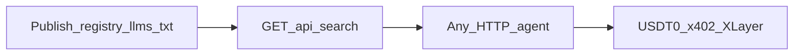

<div align="center">

# Borneo

[](#borneo)
[](#borneo)
[](#borneo)
[](https://nextjs.org/)

**Go agent-ready. Publish once. Any agent can shop you — settle USDT0 on X Layer.**

Landing → [http://localhost:3000](http://localhost:3000) · OKX docs map → [`docs/okx-onchainos.md`](./docs/okx-onchainos.md)

</div>

---

## The problem

Agent commerce is happening — but **catalogs are walled**.

Closed Instant Checkout–class listings often live where only a few chat apps can reach them. Procurement bots, local LLMs, personal agents, and custom runners get **blocked**. Merchants who only list there are invisible to the long tail of agents.

---

## Borneo @ OKX Dev Day

**Open protocol. Any agent. Settle on X Layer.**

Publish once → humans shop in chat → any HTTP agent hits the same endpoints → settle **USDT0** via **HTTP 402 / x402** on **X Layer**, facilitated by **OKX Onchain OS**.



| Step | Surface |
|---|---|
| Index | `/registry.json`, `/llms.txt`, `/s/{slug}/llms.txt` |
| Discover | `GET /api/search?q=…` |
| Buy (A2MCP-shaped) | `POST /s/{slug}/buy` → **402** → authorize → settle |
| Skills | [`.agents/skills/borneo-registry-shop`](./.agents/skills/borneo-registry-shop/SKILL.md), [okx-devday-resources](./.agents/skills/okx-devday-resources/SKILL.md), Onchain OS pack |
| MCP | Cursor: [`.cursor/mcp.json`](./.cursor/mcp.json) → `onchainos mcp` |

**Do not scrape HTML.** Catalog prose never enters the pay path — settle only sees a locked quote (`storeSlug`, `skuId`, `price`, `merchantAddress`).

---

## Try it

```bash
npm install
cp .env.example .env
# Fill BUYER_PRIVATE_KEY, MERCHANT_ADDRESS, OKX_*, Firebase, OPENAI
# See scripts/setup-xlayer-usdt0.md
npm run dev
```

| Path | What it is |
|---|---|
| `/` | Landing |
| `/merchant` · `/onboard` | Seller chat → publish agent storefront |
| `/buyer` | Fashion chat → Visa or USDT0 x402 settle |
| `/market` | Marketplace index |
| `/api/search?q=` | Intent search |
| `/registry.json` | Network store index |

### Env (see [`.env.example`](.env.example))

| Var | Purpose |
|---|---|
| `OPENAI_API_KEY` | Agents + embeddings search |
| `NEXT_PUBLIC_FIREBASE_*` | Buyer + merchant auth |
| `BUYER_PRIVATE_KEY` | Server-side x402 settle (`0x…`) |
| `MERCHANT_ADDRESS` | Default merchant payTo (`0x…`) |
| `OKX_API_KEY` / `OKX_SECRET_KEY` / `OKX_PASSPHRASE` | OKX facilitator |
| `XLAYER_NETWORK` | `eip155:1952` (testnet) or `eip155:196` |

### Onchain OS MCP

```bash
npx skills add okx/onchainos-skills --yes
# Install CLI (optional): npx -y @okxweb3/onchainos-installer install
```

Cursor loads `onchainos` from `.cursor/mcp.json` once the CLI is on your PATH and OKX credentials are set.

### Scripts

| Command | Purpose |
|---|---|
| `npm run dev` | Local Next.js |
| `npm run build` / `npm start` | Production |
| `npm run lint` | ESLint |
